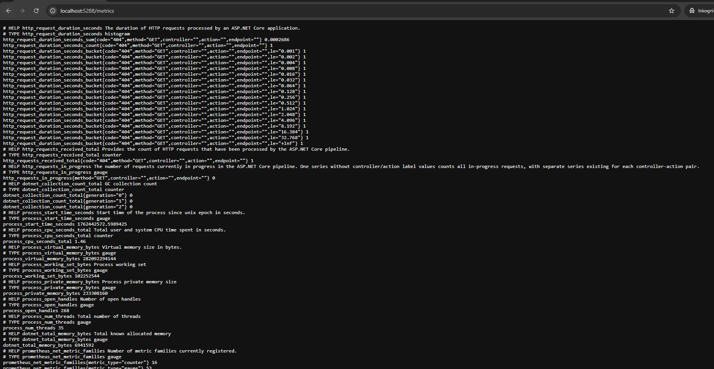
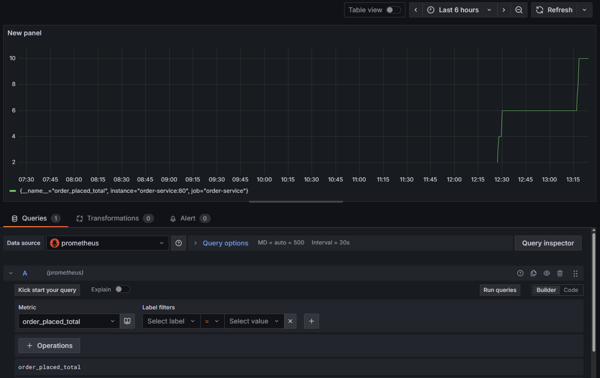
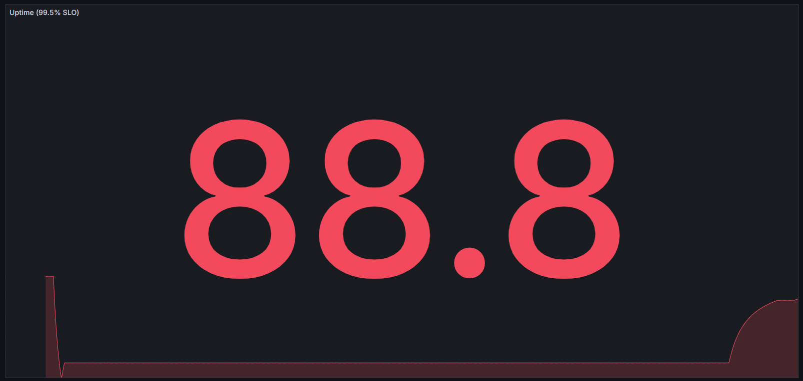

# Soft2-LargeSystemsDev-OLA5

## Group

- Oskar (Ossi-1337, cph-oo221)
- Peter (Peter537, cph-pa153)
- Yusuf (StylizedAce, cph-ya56)

## SLA

Vores SLA kan findes i [SLA.md](./SLA.md), hvor vi har defineret et par SLO'er for virksomheden.

## Kørsel af programmet og dokumentation

1. **Start Docker containere**

Man kan køre `docker-compose up -d` i roden af repositoriet for at starte containerne til projektet.

Containerne er i filen [docker-compose.yml](./docker-compose.yml).

2. **Kør API calls**

Til dette eksempel er der brugt Postman, som kan gøres på denne måde for at oprette en ordre:

POST http://localhost:5288/api/order/place

```json
{
    "status": "Done",
    "items": [
        {
            "name": "",
            "price": 100
        }
    ]
}
```

Dette vil execute controlleren i [OrderService/Controllers/OrderController.cs](./OrderService/Controllers/OrderController.cs) hvor nogle metrics vil blive genereret.

Billede af hvordan det skal se ud på Postman:


3. **Tjek Prometheus Metrics for at alt er korrekt**

Derefter kan man lige tjekke Prometheus' metrics-endpoint på Service-URL'en for at tjekke der connection med Prometheus på servicen.

I dette tilfælde er det på: http://localhost:5288/metrics

Billede af URL:



4. **Log ind på Grafana**

For at tjekke data yderligere kan vi navigerere os ind på Grafana via URL'en og porten defineret i docker-compose filen, som er port 3000 i dette tilfælde: http://localhost:3000/

5. **Tilføj Prometheus datasource til Grafana**

Gå ind på http://localhost:3000/connections/datasources, hvor man kan tilføje en ny data source ved at trykke på `Add new data source` -> `Prometheus`, og sætte `Connection` til `http://prometheus:9090` for at tilføje Prometheus, som defineret i docker-compose filen. Tryk på `Save and test` i bunden af siden for at gemme.

Vi bruger tjenestenavnet `prometheus` i stedet for `localhost`, fordi Prometheus kører i sin egen Docker-container.

6. **Opret dashboard**

Der er to muligheder at oprette dashboards på.

Først og fremmest skal man ind på http://localhost:3000/dashboards, hvorefter man klikker på `Create Dashboard`.

Første mulighed er at man derefter trykker på `Add visualization`, vælger sin datasource derefter, og så kan man vælge en metric i `Select metric` der skal vises.

Eksempel på dette er vores `order_placed_total`:



Den anden mulighed er at man også er inde på Create Dashboard, hvor at man så i stedet trykker på `Important a dashboard`, hvor man skal indsætte JSON fra f.eks. [monitoring/sla-dashboard.json](./monitoring/sla-dashboard.json) som tilføjer et pre-defined dashboard ind på Grafana.

Et eksempel på dette er hvor vi viser total update procent, hvor vi startede med at have den på 100% fordi den var aktiv, så stoppede vi servicen hvor det gik ned, så var den stabil over lang tid fordi ingen Docker containeren var aktive (så ingen metrics bliver talt), og så blev den startet og er på vej op ad nu:


